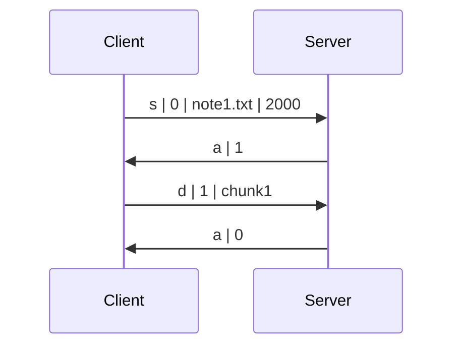

# [Simple Stop-and-Wait ARQ Implementation](https://en.wikipedia.org/wiki/Stop-and-wait_ARQ)

> Distributed and Networking Programming

## 

this code is to **write a UDP server** using Python [socket](https://docs.python.org/3/library/socket.html) module that communicates with the  client.

The client reads a file from the local file system and uploads it to the server. Note that server is supports multiple clients at once and limit the number of current "connections".

### Client Implementation

1. Client starts by sending a message in the format: `s|0|filename.ext|filesize`, where:
   - `s` means that the message type is "start";
   - `0` is the initial sequence number;
   - `filename.ext` is the name of the file to be sent (with extension);
   - `filesize` is the total size of the file to be sent (in bytes).

2. The client then expects a reply from the server in the format: `a|seqno`, where:
   - `a` means that the message type is "acknowledgement";
   - `seqno` is equal to `(x+1)%2`, where `x` is the sequence number of the message to be acknowledged.

3. If the expected server acknowledgement was received successfully, the client does the following:
   1. Split the file into chunks so that the size of a single data packet (including headers) does not exceed the buffer size of the server.
   2. Start sending file chunks, one by one, where each chunk is a message in format `d|seqno|data`, where:
      - `d` means that the message type is "data";
      - `seqno` is the sequence number of the data message, it alternates between `1` and `0`, starting from `1`;
      - `data` is the raw bytes of the file.
   3. Wait for an acknowledgement message after sending each chunk.

4. If an acknowledgement message arrives with an unexpected sequence number, the client ignores that duplicate ACK and keeps waiting for the expected ACK.

5. If an expected acknowledgement message does not arrive within 1 second, the client retransmits the message.

6. If the message is "negative acknowledgement" (see server description for details), it means that server is overloaded, and client exits.

### Server Implementation

1. Parse two integer arguments from the command line: the port number to listen on and the maximum number of simultaneously connected clients.

2. Create a UDP socket and start listening for incoming messages on `0.0.0.0:<port>`. Server should use a fixed receiver buffer size of 20480 bytes (20 Kibibytes).

3. Server should keep track of currently connected clients (i.e. clients that are transmitting file) in order to be able to reject new connections and differentiate incoming data packets.

4. Upon receiving a message from a client, act accordingly depending on the message type:
   - If the message type is `s` (start):
     - If current number of connected clients is less than limit, prepare to receive a file from the client with the given name and size. Reply with `a|seqno` (acknowledgement).
     - Otherwise, reject this new connection — reply with `n|seqno` (negative acknowledgement).
   - If the message type is `d` (data), write the delivered chunk to the file system. Reply with `a|seqno`.
   - Otherwise, terminate gracefully with an error.

5. Once the file is received completely, the server should print an indicating message, write the content to the file system, close the file and "close" the connection. "Close connection" means that the current number of transmitting clients is decreased, and the server could now accept new clients, if it was in limit.

6. If an existing file with the same name is present in the server directory, the server should print an indicating message and overwrite that file with the new one. You can assume that no clients can send a file with the same name simultaneously.

7. The server stays running unless a fatal error occurs or a `KeyboardInterrupt` is received.

> you can test your server under constant delay and packet loss. The Linux command below can be used to simulate a 15% packet loss and 1100 milliseconds constant delay over the `lo` interface. File transfer should still succeed after applying the command.
>
> ```bash
> sudo tc qdisc add dev lo root netem loss 15% delay 1100ms
> ```
>
> To undo the effect run the command again with `del` instead of `add`.

## How to run the code 

- The project structure looks like this:

  ```bash
  .
  ├── client
  │   ├── client.py
  │   ├── note1.txt
  │   ├── ...
  │   ├── note11.txt
  │   └── run_multiple_users.sh
  └── server.py
  ```

- Example run and output:

  ```bash
  $ python3 server.py 8080 10
  ('0.0.0.0', 8080):    Listening...
  ('127.0.0.1', 48256): s|0|note.txt|446
  ('127.0.0.1', 48256): d|1|chunk1
  ('0.0.0.0', 8080):    Received note.txt.
  ^C('0.0.0.0', 8080):  Shutting down...
  ```

  ```bash
  $ cd client
  $ python3 client.py 127.0.0.1:8080 note1.txt
  Client: s|0|note1.txt|446
  Server: a|1
  Client: d|1|chunk1
  Server: a|0
  ```

- Example session visualization:

